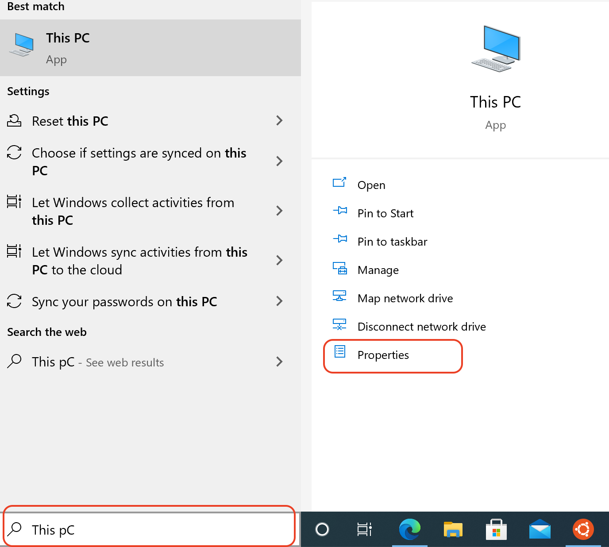
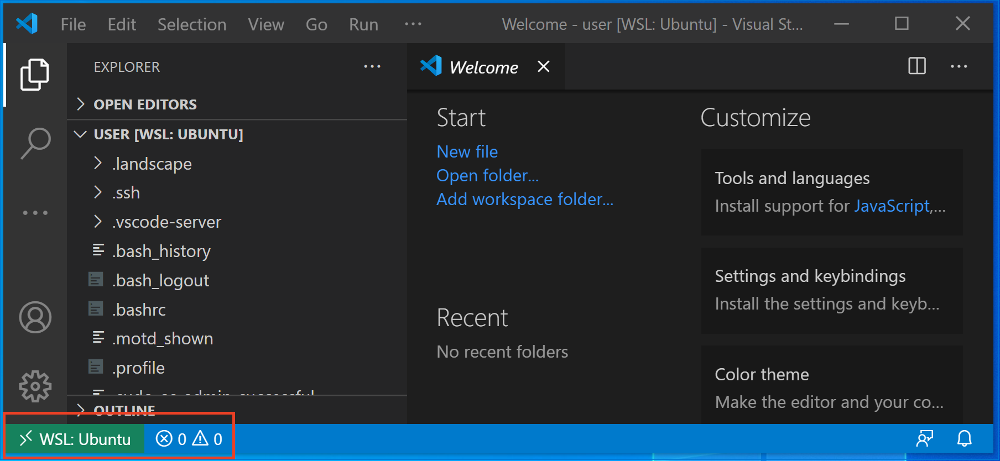

# Visual Studio (VS) Code Insallation Instruction on Windows

## Install VS Code on Windows

1. find the system type (32bit or 64bit or ARM) of your Windows system
    1. search and run This PC Properties
    
    2. note system type
    

2. download the right version of VS Code installer for your machine from here
    1. on your browser go to [https://code.visualstudio.com/download](https://code.visualstudio.com/download)

    2. if you system type is 32-bit, click 32 bit and if your system is 64-bit download 64-bit System Installer
    

3. run the dowloaded Installer program
    1. select "I Accept the agreement"
    2. select default destination folder
    
    
    
    

## Launch VS Code App from Windows

1. search for it and run it

## Configure VS Code for WSL Ubuntu

- if VS Code is configured properly both Ubuntu files and folders and Windows and Ubuntu can be accessed easily from VS Code File -> Open Menu

1. first install VS Code in Windows (see above)
2. install WSL Ubuntu (see [../WSL/README.md](../WSL/README.md))
3. run Ubuntu App to run Bash Termimal
4. enter the following command

    ```bash
    code .
    ```

5. Note that when VS Code is ran from WSL Ubuntu, you should see WSL:Ubuntu on the bottom left
    

6. install Remote - WSL extension from Microsoft in WSL:Ubuntu
    - follow the instructions found in [../../VSCode/VSCode-CPP-README.md](../../VSCode/VSCode-CPP-README.md) if you've not installed it yet

## Launch VS Code App with Remote Extension

1. open Ubuntu Bash Termimal
2. enter the following command on Ubuntu Bash Terminal

    ```bash
    code .
    ```

## Configure Terminal for VS Code

- follow the instruction on [VSCode-Terminal-README.md](VSCode-Terminal-README.md)
