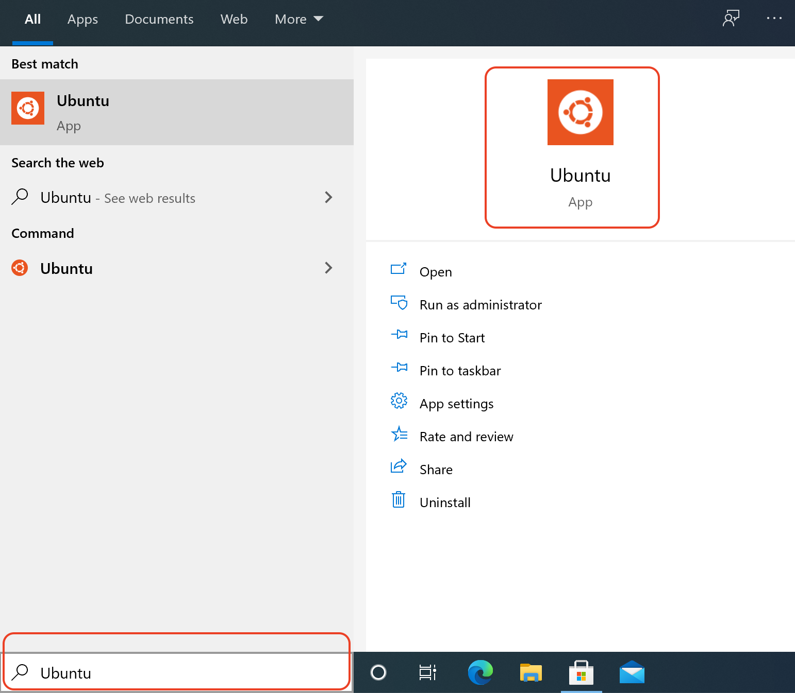

# Setting up C++ Development Environment on Windows 10

- using Windows Subsystem Layer (WSL) and Ubuntu App

## Tools

- Visual Studio Code
- Ubuntu Bash Terminal
- git version control
- GNU g++ compiler
- Jupyter Notebook
- C++ kernel for Notebook

## Find Windows 10 username

- you must know your Windows username to complete some of steps
- follow these steps to find your username on Windows

1. on Windows search for Command Prompt app
2. run Command Prompt app
    
3. type the following command on prompt, the output is your Windows username

    ```bash
    echo %username%
    ```

    

## Install Visual Studio Code

- recommended editor for writing C++ code, compiling and debugging
- editor that has many built-in features including git, terminal and many third party plugins to support many programming languages
- follow the instruction provided in [VSCode/VSCode-Install-README.md](VSCode/VSCode-Install-README.md)

## Configure Visual Studio Code

- follow the instructions in [../VSCode/VSCode-CPP-README.md](../VSCode/VSCode-CPP-README.md)

## Enable WSL and Install Ubuntu App

- follow the instructions in [WSL/README.md](WSL/README.md)

## Run Ubuntu Bash Terminal/Shell

- any time you need to run Ubuntu Bash Terminal (also called Shell), follow this step
    1. search and run Ubuntu
    

## Install C++ Compiler and relevant tools

- follow the instructions in [../Linux/CPP-README.md](../Linux/CPP-README.md)

## Install Git

- follow the instructions in [../Git/README.md](../Git/README.md)

## Configure Git

- follow the instructions in [../Git/Git-Config-README.md](../Git/Git-Config-README.md)

## Install miniconda Python Package Manager

- follow the instructions in [../Linux/Miniconda-README.md](../Linux/Miniconda-README.md)

## Install Jupyter Notebook

- follow the instructions in [../Linux/Jupyter-README.md](../Linux/Jupyter-README.md)

## Run Jupyter Notebook server

1. run Bash Terminal
2. change the working directory to the folder that contains your notebooks or should contain when you create new notebook

    ```bash
    cd <folder with notebook.ipynb files>
    jupyter notebook # run jupyter notebook from the current working directory
    ```

3. if a browser doesn’t open, copy and paste (Ctrl+v) link (just highlight and release mouse) shown on terminal to a browser

## Stop Jupyter Notebook server

1. to stop jupyter notebook, enter control+c keys on the same Terminal that's running Jupyter server

    ```bash
    control+c # press two buttons simultanesouly to stop jupyter notebook server
    ```

## Access Windows C: files and folders from Ubuntu Bash Terminal

1. run Ubuntu Terminal
2. type the following command

    ```bash
    cd  /mnt/c/Users/<your windows username>
    ```

    
